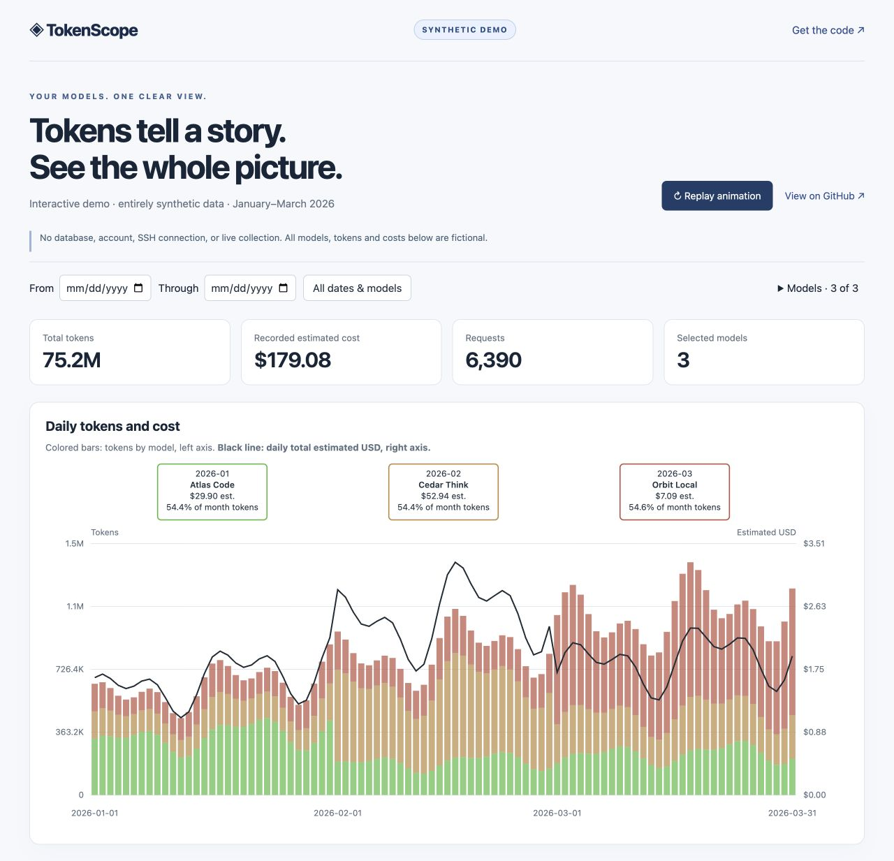

<div align="center">

# ◈ TokenScope

**English** | [简体中文](README.zh-CN.md)

### Your models. Your machines. One clear view.

A lightweight, local-first **CC-Switch usage & cost dashboard**<br>
for Codex, Claude Code, and multi-machine workflows.

**Python-powered · No frontend build · MIT licensed**

[Explore the animated demo](https://crear12.github.io/tokenscope/) · [Quick start](#quick-start) · [How counting works](#accounting-and-limitations)

</div>

[](https://crear12.github.io/tokenscope/)

*Entirely synthetic demo data. Click the snapshot to explore the animated, interactive dashboard.*

---

## From scattered usage to a single picture

See which models account for your tokens, how recorded costs change day by day,
and which model leads each month—without opening a statistics page on every machine.

| See it | Do it |
| :--- | :--- |
| **Daily tokens + cost** | Compare model-colored token bars with a daily estimated-USD line. |
| **Period-aware model leaders** | Read the top model, token share, and its cost for a day, seven-day week, full month, or custom range directly on the chart. |
| **Focused exploration** | Narrow the date range and select one or several model names. |
| **Session heatmap** | Explore session titles by date with adaptive jet colors for token usage. |
| **Session drill-down** | Click a title for token components, requests, cost, and date/model breakdowns. Shared filters apply throughout. |
| **One or many machines** | Collect locally or read remote statistics through your own private SSH configuration. |
| **macOS app** | Download a self-contained Apple silicon or Intel app from GitHub Releases; no local Python setup is needed. |
| **Refresh on your terms** | Choose 5 seconds to 10 minutes in the browser, aligned to the clock. |
| **Portable reports** | Generate PNG/SVG charts, CSV tables, and JSON/Markdown summaries. |

The live webpage needs **only Python's standard library**. No Node, database server,
cloud account, or permanently running service. Start one command; stop with Ctrl+C.

## Try it without connecting anything

Use **语言 / Language** at the top of the webpage to switch between English and
Simplified Chinese. Your browser remembers the selection; date/model filters stay
unchanged. Share a Chinese view with `?lang=zh-CN` or an English view with `?lang=en`.
Model names, source names, conversation titles and recorded USD amounts are preserved.

The [interactive demo](https://crear12.github.io/tokenscope/) uses **entirely synthetic data**: 90 days,
three fictional models, and two fictional sources. It has animated chart reveals,
a replay button, working date/model filters, and reduced-motion support. It never
reads your configuration, databases, session files, or SSH settings.

```sh
python -m http.server 8877 --bind 127.0.0.1 --directory docs
```

Open `http://localhost:8877`. To regenerate the demo, run `python build_demo.py`.
Its deterministic generator reads only the dashboard's source assets—not real usage.
The animated demo is an HTML page; GitHub's README itself does not execute JavaScript.

## Quick start

### macOS app

Download the latest **TokenScope-macOS-arm64** (Apple silicon) or
**TokenScope-macOS-x86_64** (Intel) ZIP from
[GitHub Releases](https://github.com/Crear12/tokenscope/releases), unzip it, and move
`TokenScope.app` to Applications. Open it to start the dashboard in your browser.
Use **Machine settings…** to edit your private `config.ini`; it and the refresh cache
are stored under `~/Library/Application Support/TokenScope/`, outside the app bundle.
Closing the app window stops the server and its active collection.

These downloads are unsigned because distributing a Developer ID-signed, notarized
app requires Apple's paid developer program. macOS may show a first-open warning;
use Finder's Control-click → **Open** if you trust the download. GitHub Actions builds
for this public repository do not require a paid GitHub plan.

The app listens on the LAN by default, like `python app.py`: it has no login or TLS.
Use it only on a trusted network; other LAN devices can view the dashboard and change
its shared refresh interval.

Codex native-log TPS estimates are **enabled by default**. Uncheck **Include Codex
native-log TPS estimates** in the per-session section to hide them (saved per browser).
To stop scanning native logs on a machine, set `codex_native_tps = false` in that
`[source:...]` section of your private INI configuration, then restart and refresh.
Only unique exact session ID, usage-event second and input, cached-input and output
token counts are joined. No nearest-timestamp guessing is used.
The estimated interval runs from logged user/tool input to generated output, excluding
completed tool execution and gaps between turns; client scheduling/TTFT can remain.
It is not a server stopwatch measurement or instantaneous decoding speed.
Missing/ambiguous boundaries remain unavailable. Rates containing estimates have an
**≈** prefix. Tokens, costs and request counts never change with this switch.
Older snapshots need a refresh. Native estimates remain separate in CSV/JSON
(`native_tps_count/sum/max`); diagnostic `request_tps.csv` retains recorded timings only.

Per-session tables and drill-downs include average and maximum response TPS and timing
coverage. Each recorded rate is output tokens divided by recorded response seconds
(`duration_ms`, otherwise `latency_ms`), including time to first token. Average TPS is
the arithmetic mean of successful timed response rates; maximum is the fastest
response average, not instantaneous streaming speed. Session idle gaps and input/cache
tokens are excluded. Untimed, failed, and zero-output responses are excluded from TPS,
not token accounting. Missing timing displays as unavailable, and date/model filters apply.

Requires Python 3.9+ and an existing CC-Switch database.

```sh
git clone https://github.com/Crear12/tokenscope.git
cd tokenscope
# From the project folder (Windows: use copy instead of cp)
cp config.example.ini config.ini
python app.py
```

Open `http://localhost:8765`, or use the computer's LAN IP and port from another
device. Ctrl+C stops the foreground server and its collection workers. No permanent
service is installed. The web dashboard uses only Python's standard library.

```sh
python app.py --host 127.0.0.1 --port 8765 --interval 300 --config config.ini
```

Default binding is `0.0.0.0`. **Trusted LAN only: no authentication or TLS.** LAN
visitors can view usage and change the shared refresh interval. Do not expose it
to the Internet. Use `--host 127.0.0.1` for local-only access.

The server refreshes immediately and then on local clock boundaries. The webpage
accepts intervals from 5 to 600 seconds; 300 means :00, :05, :10, etc. Busy refreshes
skip boundaries rather than overlap. Collection continues until Ctrl+C even if the
browser closes. Filters are local to each browser. Leaders and their costs use the
selected dates and models, including ties. Single-day and seven-day selections use
day and week totals; full calendar months use month totals. Other explicit ranges
use one selected-range total, even across month boundaries. With no date bounds,
the dashboard shows one leader per month.

The dashboard atomically overwrites `output/web.json`, retaining one last-successful
statistics snapshot per configured machine alongside its display data. If a machine
is disconnected or collection fails, other machines still refresh. An alert marks
the retained data as stale and source details show its original collection time.
Machines with no successful snapshot are marked unavailable and totals incomplete.
Reconnection replaces that machine's snapshot and clears its warning. Snapshots
remain private, persist across restarts, and do not create dated archives. On the
first refresh after upgrading an aggregate-only cache, offline data is retained,
but cross-machine deduplication cannot be rechecked until those machines reconnect.
Unexpected whole-refresh failures preserve the previous result. Temporary exports are cleaned up. Restart
after editing configuration. Each refresh reads all retained CC-Switch statistics;
it is not an incremental ingestion process. Sync CC-Switch first for fresh imports.

## Per-session usage

Check **Show per-session usage** in the filter bar to reveal the heatmap and table; uncheck it
to hide them without changing your data selection. Sort the table by tokens, estimated
cost, or latest selected activity. Large results show 50 sessions at a time.

Each row groups a recorded session ID within one machine and application. Usage is
first filtered by the shared date range and model selection, then summed per session.
A session spanning several days therefore shows **only its selected-day usage**,
not lifetime usage. Model switches remain in the same session, with selected models
listed together. Fresh input, cache read/write, output, total tokens, requests and
estimated USD are shown separately. Activity dates are first/last *selected* days.

Click a conversation title in either the table or heatmap to open its token components,
requests, recorded cost, and breakdowns by date and model. The heatmap includes all
matching sessions, uses an adaptive linear jet scale over observed session-day totals,
and leaves missing records blank. Hover or focus a cell for exact values.

Saved Codex names and Claude Code custom titles are read locally; missing names show
**Title unavailable**, without generating summaries or substituting message text.
Claude title lookup supports inline events, per-session `custom-title.json`, and
Claude / Claude-3p desktop metadata. When CC-Switch assigns request-scoped session
IDs, the collector joins `request_id = session:<message.id>` to the Claude log's
conversation ID. Only unique exact matches are used; ambiguous or missing links
remain unchanged. No timestamp guessing is used, and token/cost accounting is
preserved. Message bodies are not exported; only IDs and saved titles are retained.
Optional `codex_home` and `claude_projects` source settings select metadata locations.
Codex subagents are labeled **Subagent of: [parent task title]** using saved parent
metadata. Missing parent titles are explicitly marked unavailable. Sibling agents
retain distinct session identities even though their displayed titles match.
Session IDs are SHA-256 hashed before export and identity includes machine and app,
so identical titles do not merge. Hashes are pseudonymous, not anonymous.
**Saved titles can be sensitive:** they appear in your local output and are visible
to LAN viewers. Never publish your generated output. The public demo uses fictional
titles and deterministic synthetic statistics only.
Some sources use request-scoped session IDs. Requests without usable IDs and
historical rollups cannot be assigned to sessions; their tokens remain in the daily
charts and are reported as lacking session detail. Old caches require one successful
refresh with the updated collector. Static exports also include `session_daily_usage.csv`.

## Optional remote sources

Add source sections to your private `config.ini`. Each needs a unique display name,
`transport = ssh`, `host` (your SSH destination), `python` (remote interpreter path),
and `database` (remote database path). OpenSSH with key/agent authentication and
remote Python with SQLite support are required. No remote connection names or
addresses are shipped. The collector executes a read-only reader in memory, without
installing software or copying the database. Keep all connection details private.

## Static charts and summaries

```sh
python -m pip install -r requirements.txt
python update.py
python update.py --hosts local
python -m unittest discover -s . -p 'test_*.py'
```

Matplotlib is required only for static charts. Outputs overwrite fixed filenames
under `output/local/` for one source or `output/overall/` for multiple sources:
token/cost PNG and SVG charts, a machines chart, daily CSV, diagnostic request TPS
CSV, and JSON/Markdown summaries. TPS is not plotted. All configured sources must
succeed; failures are reported rather than presenting partial results as complete.

## Accounting and limitations

- Total tokens = fresh input + cache read + cache creation + output. Cache handling
  honors CC-Switch's input-token semantics; reasoning tokens are not independently
  available in this schema and are not added as an estimate.
- Costs are recorded CC-Switch USD estimates, not invoices or subscription fees.
  Zero recorded cost can mean missing pricing rather than free usage.
- Dates follow each source's local calendar. Historical rollups cannot be rebucketed.
- Matching imported session/proxy rows are deduplicated using app, model, token
  counts and a 600-second window. Identical cross-host request IDs count once;
  conflicting values fail. Rollups lack original IDs and may overlap across hosts.
- Provider metadata can be joined from the first Codex session header. Session
  text is not exported. Missing metadata remains explicitly unknown.
- Claude Desktop gateway rows are grouped with Claude Code; this is not coverage
  of every Desktop conversation. Source data quality limits reporting accuracy.
- Diagnostic TPS uses output tokens / recorded request duration, with latency
  fallback. Requests without positive timing and output have no TPS sample.

## Privacy and publishing

Only source files, tests, this README, requirements, the example configuration and
`.gitignore` belong in Git. Never publish real configuration, databases, generated
outputs, screenshots of private usage, SSH files, credentials, or session logs.
The database reader selects usage fields and provider display names, not provider
settings, credentials or prompts. The title reader also reads saved conversation
names. Aggregates reveal usage, source display names and saved titles to dashboard
viewers; they are not anonymous.

`.gitignore` is a safeguard, not a secret scanner: review staged files before every
push. Publish this folder as a fresh repository, not a parent project or private Git
history. `docs/` contains only the synthetic demo and its public assets.

## Project map

```text
app.py            Foreground web server and refresh orchestration
collect.py        Read-only CC-Switch statistics reader
update.py         Accounting, summaries, and static chart generation
web.*             Dashboard interface, shared with the demo
config.example.ini  Public local-only configuration template
build_demo.py     Deterministic fictional-data demo builder
docs/             Static demo, ready for GitHub Pages
test_*.py         Accounting, HTTP-control, and demo tests
```

## License & attribution

[MIT](LICENSE) · Copyright © 2026 Crear12.

An independent companion to [CC-Switch](https://github.com/farion1231/cc-switch),
not an official billing tool or an affiliated product. Collection depends on the
supported CC-Switch SQLite schema; schema changes may require an update.
